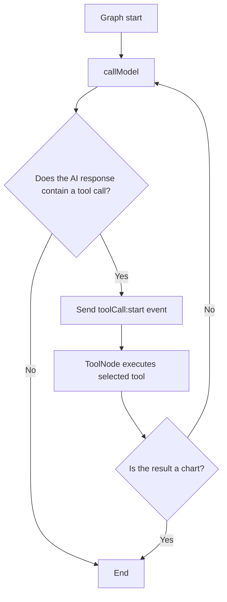
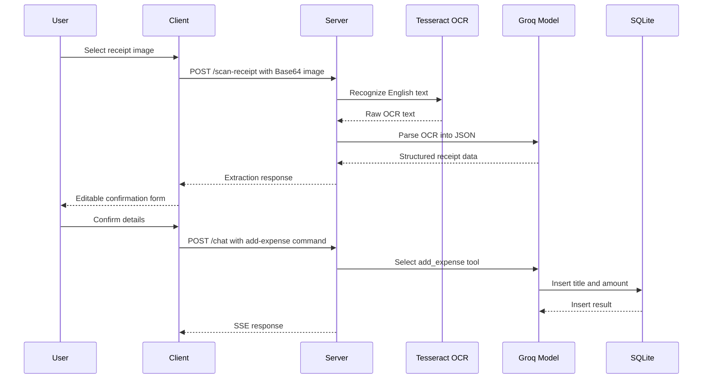

# Nexus Expense AI: Project Documentation

## 1. Overview

Nexus Expense AI is a conversational expense management application. Instead of relying only on traditional forms and manually prepared reports, it allows users to manage expenses through natural language, generate spending visualizations, and scan receipts.

The application combines a React chat interface with an Express API, a LangGraph tool-calling agent, Groq models, Tesseract.js OCR, Recharts, and a local SQLite database.

## 2. Main Capabilities

- Record expenses with natural-language prompts
- Query expenses for a specific date range
- Generate daily, weekly, or monthly spending charts
- Upload receipt images
- Extract receipt text with OCR
- Convert OCR text into structured receipt data with an LLM
- Review and edit extracted data before confirmation
- Stream AI responses and tool activity with Server-Sent Events
- Persist expense records in SQLite

## 3. System Architecture

```text
User
  |
  +--> React Chat UI -- POST /chat --> Express API
  |                                      |
  |                                      v
  |                              LangGraph Agent
  |                                      |
  |                                      v
  |                                Groq Model
  |                                      |
  |                                      v
  |                  add_expense / get_expenses / generate_chart
  |                                      |
  |                                      v
  |                              SQLite expenses.db
  |
  +--> POST /scan-receipt --> Tesseract.js OCR --> Groq extraction --> Review UI
```

The repository contains two independent npm applications:

- `client/`: React, TypeScript, Vite, Tailwind CSS, and Recharts frontend
- `server/`: Express API, LangGraph agent, LangChain tools, OCR pipeline, and SQLite persistence

## 4. Backend Files

### `server.ts`

The Express entry point. It configures JSON parsing with a 10 MB limit, enables CORS, exposes the two API endpoints, and listens on port `3000`.

### `agent.ts`

The AI orchestration layer. It loads environment variables, initializes SQLite, configures `ChatGroq`, registers the expense tools, builds the LangGraph state machine, and compiles it with an in-memory `MemorySaver` checkpointer.

The configured model is `openai/gpt-oss-120b` with temperature `0` for deterministic tool selection.

### `tool.ts`

Defines the three server-side tools available to the model:

#### `add_expense`

Accepts a title and numeric amount, then inserts them into SQLite using a parameterized query. It returns the inserted row ID and a success status.

```json
{
  "title": "Coffee",
  "amount": 500
}
```

#### `get_expenses`

Accepts `from` and `to` dates in `YYYY-MM-DD` format. It filters records using `DATE(created_at)`, orders them newest first, and returns the matching rows.

#### `generate_chart`

Accepts a date range and a `groupBy` value of `date`, `week`, or `month`. It aggregates `SUM(amount)` and transaction counts with SQLite date functions, then transforms the result for the frontend chart.

Example result:

```json
{
  "type": "chart",
  "data": [
    { "month": "2026-07", "amount": 450 }
  ],
  "labelKey": "month"
}
```

### `db.ts`

Creates or opens the SQLite database and creates the `expenses` table when it does not already exist.

Current schema:

```sql
CREATE TABLE IF NOT EXISTS expenses (
  id INTEGER PRIMARY KEY AUTOINCREMENT,
  title TEXT NOT NULL,
  amount REAL NOT NULL,
  created_at TEXT DEFAULT CURRENT_TIMESTAMP
)
```

### `scanner.ts`

Implements the receipt pipeline:

1. Removes the Base64 data URL prefix.
2. Converts the image to a Node.js `Buffer`.
3. Runs Tesseract.js with the English `eng` trained data.
4. Sends the raw OCR text to the Groq model.
5. Extracts JSON containing amount, title, category, date, and confidence.
6. Returns a fallback object when extraction cannot be parsed.

### `types.ts`

Defines the stream message contract used for AI text, tool-call notifications, and tool results:

- `ai`
- `toolCall:start`
- `tool`

## 5. LangGraph Agent Flow



### Model node

`callModel` invokes the Groq model with a system prompt explaining the assistant's responsibilities and tool-selection rules:

- Use `add_expense` for logging, adding, or recording an expense.
- Use `get_expenses` for text-based expense lists and date-range queries.
- Use `generate_chart` only when the user explicitly requests a chart, graph, visualization, or visual breakdown.
- Convert relative dates into exact `YYYY-MM-DD` values using the current date.

The model response is appended to the graph message state.

### Tool routing

`shouldContinue` checks the latest AI message. If it contains tool calls, it writes a custom `toolCall:start` event and routes execution to LangGraph's prebuilt `ToolNode`. Otherwise, the graph ends.

After tool execution, `shouldEnd` parses the tool result. Chart results end the graph because the client can render them directly. Other results return to `callModel`, allowing the model to generate a user-facing response.

## 6. Chat Request and SSE Flow

1. The client sends `{ "query": "..." }` to `POST /chat`.
2. The server starts `agent.stream()` with `messages` and `custom` stream modes.
3. AI message chunks are sent as `type: "ai"` events.
4. Tool start notifications are sent as `type: "toolCall:start"` events.
5. Tool output is sent as `type: "tool"` events.
6. The client appends consecutive AI chunks to one message.
7. Tool results are rendered as activity, JSON, or a chart.

SSE keeps a normal HTTP response open and sends one-way server-to-client events using the `text/event-stream` content type. The client consumes the stream with `@microsoft/fetch-event-source`.

Example events:

```json
{"type":"toolCall:start","payload":{"name":"add_expense","args":{"title":"coffee","amount":500}}}
```

```json
{"type":"tool","payload":{"name":"add_expense","result":{"status":"success"}}}
```

```json
{"type":"ai","payload":{"text":"Expense added successfully."}}
```

## 7. Receipt Scanning Flow



The extracted receipt object contains:

```json
{
  "amount": 850,
  "title": "Coffee Shop",
  "category": "food",
  "date": "2026-09-03",
  "confidence": "high"
}
```

After confirmation, the client creates a natural-language command such as:

```text
Add expense of Rs 850 for Coffee Shop under category food on date 2026-09-03
```

That command follows the normal `/chat` and `add_expense` flow.

## 8. Frontend Components

- `App.tsx`: Application root that renders the chat experience.
- `ChatContainer.tsx`: Coordinates messages, SSE events, receipt scanning, confirmation, and auto-scrolling.
- `ChatInput.tsx`: Provides text input, Enter-to-submit behavior, multiline input, and image attachment.
- `ChatMessage.tsx`: Renders user messages, AI messages, tool activity, tool payloads, and charts.
- `ReceiptConfirm.tsx`: Displays editable amount, merchant, category, and date fields before saving.
- `ExpenseChart.tsx`: Renders daily, weekly, or monthly expense data with a Recharts bar chart.

## 9. Concepts Used

### LLM tool calling

The model chooses from structured tools instead of directly accessing the database. Server-side functions perform the actual database operations.

### State-machine orchestration

LangGraph models the interaction as nodes and conditional edges. This makes the cycle of model response, tool execution, and final response explicit.

### Schema validation

Zod schemas validate tool arguments, including numeric amounts, date fields, and the allowed chart grouping values.

### Parameterized SQL

Insert and date-filter queries use bound parameters. This keeps user-provided values separate from SQL syntax.

### OCR plus LLM extraction

Tesseract.js handles image-to-text recognition, while the Groq model normalizes messy OCR text into application-friendly structured data.

### Human confirmation

Receipt extraction is treated as an editable suggestion. The user can correct the extracted values before triggering the save flow.

### Local persistence

SQLite provides a simple file-based relational database suitable for local development and single-user use.

## 10. Running the Project

### Requirements

- Node.js 22.5 or newer, because the backend uses `node:sqlite`
- npm
- A Groq API key

### Backend

```bash
cd server
npm install
```

Create `server/.env`:

```env
GROQ_API_KEY=your_groq_api_key
```

Start the API:

```bash
npm run dev
```

The API runs at `http://localhost:3000`.

### Frontend

In a second terminal:

```bash
cd client
npm install
npm run dev
```

Open the local URL printed by Vite, usually `http://localhost:5173`.

## 11. Current Limitations

- The database stores `title`, `amount`, and `created_at`; category is extracted but not persisted.
- Receipt dates are extracted but are not passed to the current insert query, so confirmed receipts use the database timestamp.
- The chat thread ID is hard-coded to `"1"`; multi-user session isolation is not implemented.
- Receipt OCR is configured for English only.
- CORS is broadly enabled and should be restricted in production.
- Base64 image uploads can increase request size and memory usage.
- Authentication, rate limiting, and production database management are not configured.
- The server test script is currently a placeholder; automated tests have not been configured.

## 12. Recommended Improvements

1. Add `category` and user-provided `expense_date` columns.
2. Update `add_expense` to persist category and receipt date.
3. Derive the LangGraph thread ID from an authenticated user or session.
4. Add request validation, centralized error handling, and cancellation support.
5. Add unit and integration tests for tools, scanner behavior, and API endpoints.
6. Restrict CORS and add authentication and rate limiting for deployment.
7. Add image preprocessing and additional OCR languages.
8. Evaluate indexes for date-based queries as the dataset grows.

## 13. Summary

Nexus Expense AI combines a chat-first interface, LLM tool calling, LangGraph orchestration, OCR, SSE streaming, and SQLite persistence. The user provides a natural-language request or receipt image; the backend interprets it, executes controlled tools, stores or aggregates data, and streams the result back to the interface. Receipt data is intentionally presented for human review before the save flow begins.
